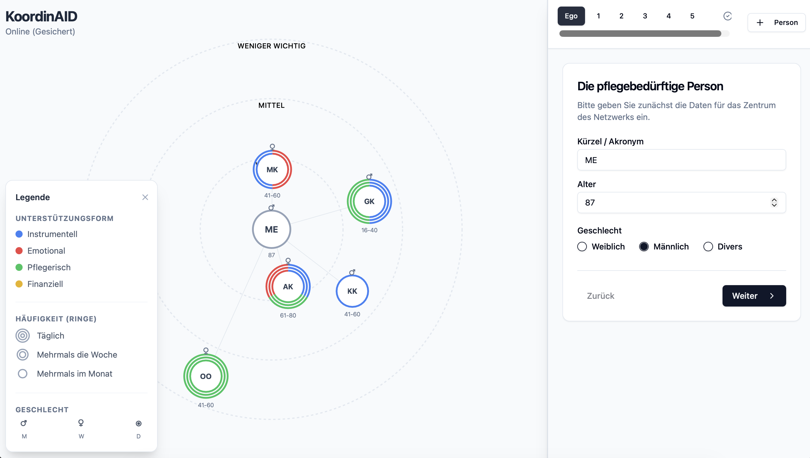

# KoordinAID - Egozentrierte Netzwerk-Visualisierung für die Pflegeberatung

KoordinAID ist eine Webanwendung zur digitalen Erhebung und Visualisierung von sozialen Netzwerken im Pflegekontext. Sie ermöglicht es, das Unterstützerumfeld einer pflegebedürftigen Person (Ego) interaktiv zu erfassen und grafisch darzustellen.

Es ist digitalisierte Variante des BZPD-Projektes [KoordinAID](https://www.hs-kempten.de/bzpd-bayerisches-zentrum-pflege-digital/projekte/koordinaid) unter Leitung von [Dr. Tobias Wörle](https://www.hs-kempten.de/personen/tobias-woerle). 



## 🌟 Features

*   **Interaktive Visualisierung:** Echtzeit-Rendering des Netzwerks mit D3.js.
*   **Visuelle Kodierung:**
    *   **Nähe zum Zentrum:** Wichtigkeit der Person.
    *   **Farbige Segmente:** Art der Unterstützung (Instrumentell, Emotional, Pflegerisch, Finanziell).
    *   **Konzentrische Ringe:** Häufigkeit des Kontakts.
*   **Responsive Design:** Split-View auf Desktop/Tablet, Wizard-Modus auf Smartphones.
*   **Datenschutz:** Anonyme Datenspeicherung via Supabase mit Row Level Security (RLS).
*   **Export-Ready:** Daten werden als strukturiertes JSONB gespeichert.

*   **Work in progress:** Das Projekt soll durch einen Nutzerzententrieten Ansatz weiterentwickelt werden
    *  **Feature requests:** 
        * Gravitation von Beziehungstypen in eine Ecke
        * Neutrale Startkategorien
        * 1. Frage: Wo vermutet größte Bedarfe?
        * Dienstleister als eigene Symbole

## 🛠 Tech Stack

*   **Frontend:** [React](https://react.dev/) + [TypeScript](https://www.typescriptlang.org/)
*   **Build Tool:** [Vite](https://vitejs.dev/)
*   **Styling:** [Tailwind CSS](https://tailwindcss.com/) + [shadcn/ui](https://ui.shadcn.com/)
*   **Visualisierung:** [D3.js](https://d3js.org/) (Force Simulation & SVG Rendering)
*   **Backend / Datenbank:** [Supabase](https://supabase.com/) (PostgreSQL)
*   **Icons:** [Lucide React](https://lucide.dev/)

## 🚀 Installation & Setup

### Voraussetzungen
*   Node.js (Version 18 oder höher)
*   Ein Supabase-Projekt

### 1. Repository klonen
```bash
git clone https://github.com/DEIN-USERNAME/koordin-aid.git
cd koordin-aid
```

2. Abhängigkeiten installieren
```bash
npm install
```

3. Umgebungsvariablen setzen
Erstelle eine Datei .env im Hauptverzeichnis und trage deine Supabase-Daten ein:
env

```
VITE_SUPABASE_URL=https://dein-projekt.supabase.co
VITE_SUPABASE_ANON_KEY=dein-anon-key-hier
```

4. Entwicklungsserver starten
```bash
npm run dev
```

Die App läuft nun unter http://localhost:5173.

🗄 Datenbank Setup (Supabase)
Führe folgenden SQL-Code im Supabase SQL Editor aus, um die Tabelle mit Sicherheitsregeln (RLS) zu erstellen:
```sql
create table surveys (
  id bigint generated by default as identity primary key,
  created_at timestamp with time zone default timezone('utc'::text, now()) not null,
  user_id uuid default auth.uid(),
  network_data jsonb not null
);

alter table surveys enable row level security;

-- Policies für authentifizierte (anonyme) Nutzer
create policy "Users can see own data" on surveys for select to authenticated using (auth.uid() = user_id);
create policy "Users can insert own data" on surveys for insert to authenticated with check (auth.uid() = user_id);
Hinweis: "Anonymous Sign-ins" müssen im Supabase Dashboard unter Authentication -> Providers aktiviert sein.
```

## 📂 Projektstruktur
```text
src/
├── components/
│   ├── network/         # D3.js Visualisierung (Graph, Nodes, Legende)
│   ├── questionnaire/   # Formular-Logik (Ego, Alteri, Meta)
│   └── ui/              # Wiederverwendbare UI-Komponenten (Buttons, Inputs)
├── lib/                 # Supabase Client & Utils
├── types/               # TypeScript Definitionen (Datenmodell)
└── App.tsx              # Hauptlayout & State Management
```

## 📄 Lizenz
Dieses Projekt wurde für wissenschaftliche/soziale Zwecke entwickelt.